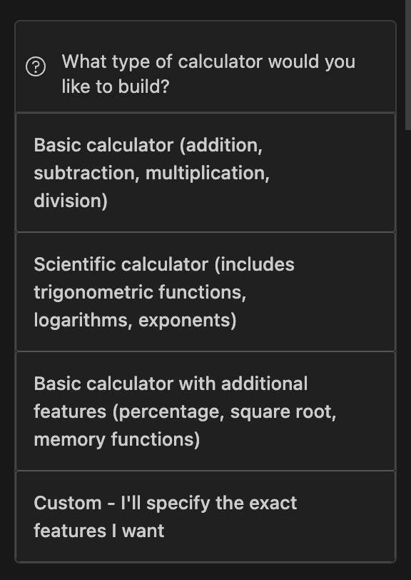
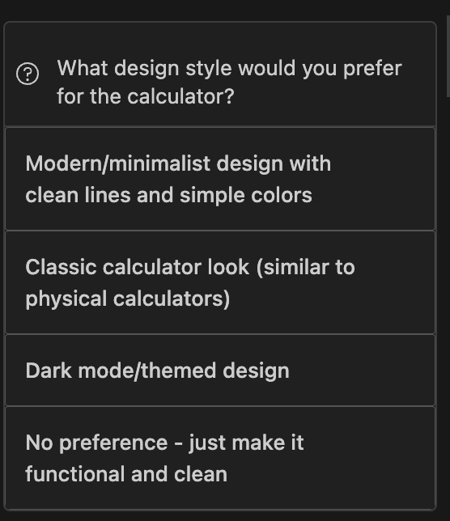
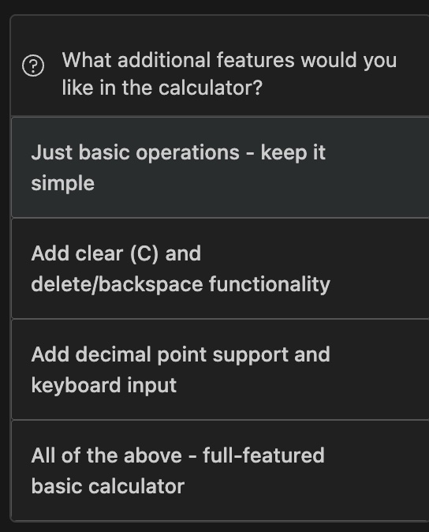

# Bob Bootcamp — Build a Calculator App

**Duration:** 45 minutes | **Difficulty:** Beginner to Intermediate | **Lab:** 1

---

## What you'll build

A dark-theme calculator app with three files:

- `index.html` — the buttons and display
- `styles.css` — the dark theme and layout
- `calculator.js` — all the logic (adding, subtracting, etc.)

---

## Learning objectives

By the end of this lab, you will:

✅ Understand Bob's three modes (Plan, Code, Ask)
✅ Use auto-approvals for rapid development
✅ Practice literate coding techniques
✅ Integrate GitHub using MCP servers
✅ Build a complete calculator application

---

## Prerequisites

Before starting, ensure you have:

- [ ] Git installed and configured
- [ ] Bob installed and running
- [ ] GitHub account (for MCP integration)
- [ ] A browser to test the app

---

## Understanding Bob's modes

Bob has three distinct modes, each optimized for different tasks:

> 🎯 **Bob Differentiator: Customizable Modes** Bob's mode system is one of its key differentiators. Unlike other AI assistants, Bob allows you to create custom modes tailored to your team's specific workflows. The three built-in modes you'll use in this lab are just the beginning—you can create specialized modes for code review, documentation, architecture design, and more.

**🎯 Plan mode**

When to use: Planning, designing, strategizing
- Create project structures
- Design layouts and architecture
- Plan class design and state management
- Make decisions before writing code

**💻 Code mode**

When to use: Writing, modifying, refactoring code
- Implement features
- Create files
- Modify existing code
- Fix bugs

**❓ Ask mode**

When to use: Learning, understanding, getting help
- Explain code concepts
- Get documentation
- Understand errors
- Learn best practices

**⚡ Advanced mode**

When to use: When you need external tools
- Everything Code mode does
- Plus MCP servers (GitHub, JIRA, databases, internal APIs)

**Switching between modes**

In Bob's interface:
1. Look for the mode selector at the top
2. Click to see available modes
3. Select the mode you need
4. Bob will adapt its behaviour accordingly

💡 **Tip:** You can switch to Ask mode at any point during the lab if something is unclear. Example questions to try:
- *"What is the difference between using data-* attributes and button IDs?"*
- *"How do chain operations work in this calculator?"*
- *"Why does compute() set shouldResetScreen to true?"*
- *"What happens if the user presses an operator twice in a row?"*
- *"Why do we need to guard against division by zero?"*

## Lab timeline

```
Lab 1 (45 min)
├── Step 1: Plan the structure         — Plan mode     (5 min)
├── Step 2: Build HTML & CSS           — Code mode     (15 min)
├── Step 3: Create unit tests and run them — Code mode  (15 min)
├── Step 4: GitHub integration         — Advanced mode (10 min)
└── Step 5: Testing & verification     —               (5 min)
```

---

## Step 1 — Plan the structure (Plan mode, 5 min)

### What to do
1. Click the mode selector in Bob's interface
2. Select **Plan mode**
3. Copy and send this prompt:

```
I want to build a calculator app with HTML, CSS, and vanilla JavaScript. Ask me clarifying questions before planning anything.
```

---

### What happens — Bob asks you 3 questions

Instead of jumping straight into generating code, Bob asks you questions first.
This ensures it builds exactly what you need, not what it assumes you want.

---

**Question 1 — What functionality do you want?**



> *"What type of calculator would you like to build?"*

Select: **Basic calculator (addition, subtraction, multiplication, division)**

---

**Question 2 — What should it look like?**



> *"What design style would you prefer for the calculator?"*

Select: **Modern/minimalist design with clean lines and simple colors**

---

**Question 3 — How should operations work?**



> *"What additional features would you like in the calculator?"*

Select: **Just basic operations - keep it simple**

---

### Bob's plan output

After your answers, Bob generates a full **📝 Plan** covering:

**File structure:**
```
calculator-app/
├── index.html    # The buttons and display
├── styles.css    # Minimalist design and layout
└── script.js     # All the calculator logic
```

**Bob's implementation checklist:**
- [ ] Create project structure with HTML file (index.html)
- [ ] Build HTML structure with display and button layout
- [ ] Create CSS file (styles.css) with modern/minimalist design
- [ ] Style the calculator display area
- [ ] Style number and operator buttons with clean aesthetics
- [ ] Create JavaScript file (script.js) for calculator logic
- [ ] Implement number input handling
- [ ] Implement operator selection (+, -, *, /)
- [ ] Implement equals functionality to calculate results
- [ ] Add basic error handling (division by zero)
- [ ] Test all operations to ensure correct calculations

💡 **Tip:** Keep this checklist open. It maps directly to Steps 2 and 3.

---

## Step 2 — Build HTML & CSS (Code mode, 15 min)

### What to do
1. Switch Bob to **Code mode**
2. Turn on **auto-approvals** (see below)
3. Send the prompt below

### 2.1 What are auto-approvals?

Normally Bob asks "can I create this file?" before every file it makes.
Auto-approvals skip those confirmation dialogs so Bob can create multiple
files in one go without stopping.

**How to enable:**
1. Look for the auto-approval toggle at the bottom of Bob's interface
2. Switch it on
3. Bob will now create files without pausing for confirmation

⚠️ **Important:** Review the files after Bob creates them to ensure they match your requirements.

### 2.2 Understanding literate coding

Literate coding means writing code with comments that explain *why* a decision was made — not just *what* the code does.

**Without literate coding:**
```javascript
this.shouldResetScreen = true;
```

**With literate coding:**
```javascript
// After computing a result, the next digit press should start a
// fresh number rather than appending to the result.
// Example: after 3+2=5, pressing 7 should show 7, not 57.
this.shouldResetScreen = true;
```

> 🎯 **Bob differentiator:** Ask Bob to use literate coding and it will write comments that help you and your teammates understand the decisions behind the code.

### 2.3 Prompt for Bob

```
Create a dark-theme calculator with HTML, CSS, and JavaScript. 4-column button grid, orange operators, gray function buttons. Use literate coding in the JavaScript so comments explain why each decision was made. Enable auto-approvals.
```

> **Why `data-*` attributes?**
> Each button stores its own value in a `data-*` attribute, for example
> `data-number="7"` or `data-operator="+"`. JavaScript can then find all
> number buttons at once with `querySelectorAll('[data-number]')` and read
> their value with `btn.dataset.number` — no individual IDs needed.

### 2.4 What Bob builds

Bob creates both files and opens the calculator in your browser automatically.

**Key CSS pattern Bob uses:**
```css
.buttons {
  display: grid;
  grid-template-columns: repeat(4, 1fr); /* 4 equal columns */
  gap: 1px;
  background: #111;
  /* The 1px gap + dark background creates visible divider lines
     between buttons — no borders needed */
}

.btn-equals { grid-column: span 2; } /* = spans 2 columns */
.btn-zero   { grid-column: span 2; } /* 0 spans 2 columns */
```

✅ **Checkpoint:** Open `index.html` in your browser. You should see the dark calculator with all buttons laid out correctly. The buttons are not functional yet — that comes after Step 3.

> 🎯 **Bob differentiator:** In Code mode with auto-approvals, Bob creates real
> files directly in your project folder — not just code snippets for you to copy
> and paste manually.

---

## Step 3 — Create unit tests and run them (Code mode, 15 min)

**Stay in Code mode.**

### 3.1 Prompt for Bob — unit tests

```
Create unit test cases for the calculator covering all operations, and ensure at least 90% code coverage.
```

Bob will create a test file and run it automatically. It should cover:
- Basic operations: addition, subtraction, multiplication, division
- Edge cases: divide by zero, decimal input, chained operations
- Clear and reset functionality

### 3.2 Run the tests

**Prompt for Bob:**
```
Run the unit tests and show me the results.
```

✅ **Checkpoint:** All tests should pass with at least 90% code coverage.

## Step 4 — GitHub integration (Advanced mode, 10 min)

### What to do
1. Switch Bob to **Advanced mode**
2. Send the prompts below

### 4.1 Why Advanced mode?

Advanced mode has everything Code mode has, plus access to **MCP servers**.

An MCP server (Model Context Protocol) is a connection between Bob and an
external tool — in this case GitHub. With the GitHub MCP server connected,
Bob can run git commands on your behalf through natural language.

> 🔧 **Bob differentiator:** Other AI tools work in isolation. Bob connects
> to your tools — GitHub, JIRA, databases, internal APIs — and operates them
> through natural language. You stay in one interface instead of switching
> between Bob and your terminal.

### 4.2 Prompt for Bob — initialise git

```
Use the GitHub MCP server to initialise a git repo and create a .gitignore for an HTML/CSS/JS project, then commit all files with message "Initial calculator implementation".
```

**What Bob does behind the scenes:**
```
git init
# writes .gitignore
git add .
git commit -m "Initial calculator implementation"
```

### 4.3 Prompt for Bob — create GitHub repository

```
Create a new GitHub repository called "bob-calculator-app", push the code, and share the URL.
```

**What Bob does behind the scenes:**
```
# Creates the repo via GitHub API
git remote add origin https://github.com/YOUR_USERNAME/bob-calculator-app.git
git branch -M main
git push -u origin main
```

### 4.4 Verify on GitHub

1. Open the repository URL Bob gives you
2. Confirm these files are present: `index.html`, `styles.css`, `calculator.js`
3. Check the commit history shows your commit message

✅ **Checkpoint:** Your code is live on GitHub.

---

## Step 5 — Testing & verification (5 min)

Open `index.html` in your browser and run through these tests:

### Basic operations
| What to type | Expected result |
|--------------|----------------|
| `5 + 3 =` | 8 |
| `10 - 4 =` | 6 |
| `6 × 7 =` | 42 |
| `15 ÷ 3 =` | 5 |

### Chain operations
| What to type | Expected result |
|--------------|----------------|
| `5 + 3 =` then `+ 2 =` | 10 |
| `10 ÷ 2 =` then `× 3 =` | 15 |

### Edge cases
| What to type | Expected result |
|--------------|----------------|
| `0.1 + 0.2 =` | 0.3 (not 0.30000000000000004) |
| `1 ÷ 0 =` | Shows an error or alert — does not crash |
| Type `3.1` then `.` again | Second decimal point is blocked |

### Keyboard shortcuts
| Key | What it does |
|-----|-------------|
| `0` to `9` | Types the number |
| `+` `-` `*` `/` | Selects the operator |
| `Enter` or `=` | Calculates the result |
| `Escape` | Clears everything (same as AC) |
| `Backspace` | Deletes the last digit |

### Browser console check
Open developer tools with `F12` and check the Console tab:

✅ No red error messages
✅ All buttons respond when clicked
✅ Keyboard shortcuts work

---

## Congratulations! 🎉

You have completed Lab 1. Here is what you built and practised:

| What you did | Bob mode used |
|--------------|--------------|
| Designed the app structure before coding | Plan mode |
| Created HTML and CSS files | Code mode + auto-approvals |
| Built the Calculator class with literate coding | Code mode |
| Connected buttons to the Calculator class | Code mode |
| Asked questions about the generated code | Ask mode |
| Pushed the project to GitHub | Advanced mode + MCP |

---

## Key takeaways

**Plan mode** — Always plan before you build. Bob's clarifying questions ensure
it builds exactly what you need, not what it assumes you want.

**Code mode + auto-approvals** — Bob creates real files in your project, not
snippets. Auto-approvals let it work through multiple files without stopping.

**Literate coding** — Comments that explain *why*, not just *what*. Makes your
code readable for teammates and for your future self.

**Ask mode** — When you don't understand something Bob built, Ask mode explains
it without touching your files.

**Advanced mode + MCP** — Bob connects to external tools like GitHub through
natural language. No terminal switching required.

> 💡 **Behind the scenes:** While you were building, Bob automatically chose
> the right AI model for each task. Powerful models for complex decisions,
> lighter models for simple file operations. This reduces AI costs by up to 60%
> without you having to manage it.

---

## Next steps

- Add a calculation history log (plan it first with Plan mode)
- Build a scientific mode with sin, cos, and square root
- Continue to **Lab 2: Security Analysis →**

---

## Troubleshooting

**Buttons do nothing when clicked**
- Open browser console (F12) and check for red errors
- Confirm `calculator.js` is linked at the bottom of `index.html`
- Check that `data-number`, `data-operator`, `data-action` attributes exist on the buttons

**Layout looks wrong or buttons overlap**
- Confirm `.buttons` has `display: grid` and `grid-template-columns: repeat(4, 1fr)`
- Confirm `.btn-equals` and `.btn-zero` have `grid-column: span 2`
- Try a hard refresh: `Cmd+Shift+R` on Mac, `Ctrl+Shift+R` on Windows

**GitHub push fails**
- Confirm you are in **Advanced mode**, not Code mode
- Check that the GitHub MCP server is connected in Bob's settings
- Confirm your GitHub personal access token has `repo` permissions

---

## Repository structure

```
bob-bootcamp-calculator/
├── docs/
│   ├── step1-q1.png      ← Screenshot: Bob's question 1
│   ├── step1-q2.png      ← Screenshot: Bob's question 2
│   ├── step1-q3.png      ← Screenshot: Bob's question 3
│   └── step2-result.png  ← Screenshot: calculator after Step 2
└── lab1/
    ├── starter/           ← Open this folder to begin
    │   ├── index.html     (blank scaffold with instructions)
    │   ├── styles.css     (blank scaffold with instructions)
    │   └── calculator.js  (blank scaffold with instructions)
    └── solution/
        └── calculator-app/
            ├── index.html
            ├── styles.css
            └── calculator.js
```

---

*Bob Bootcamp · MEA Watsonx Bootcamp · IBM Client Engineering*
